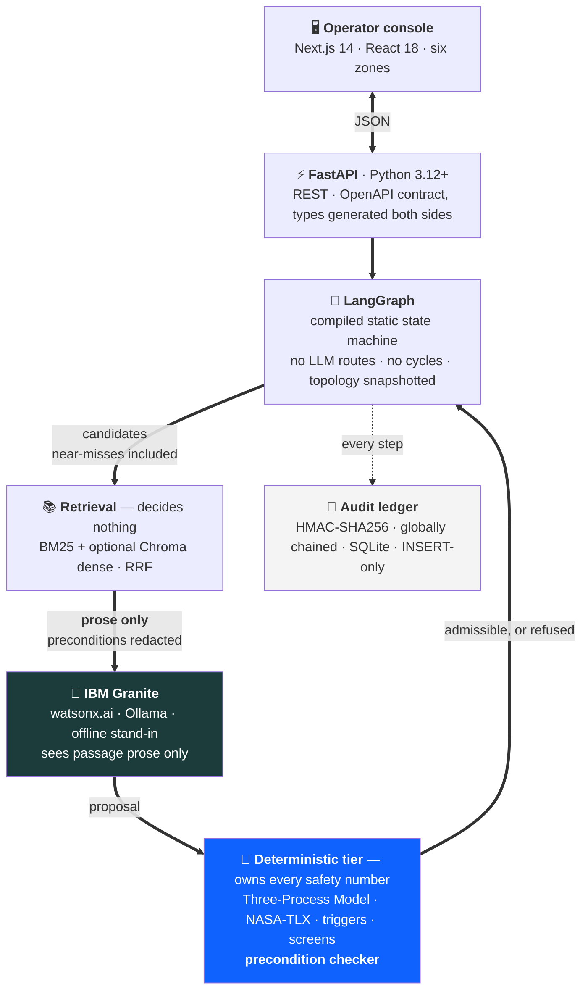
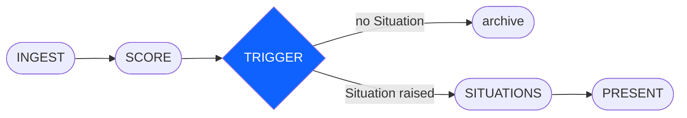
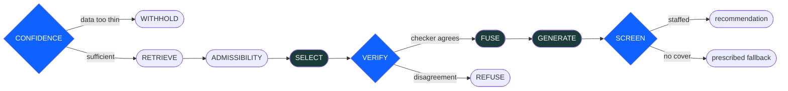
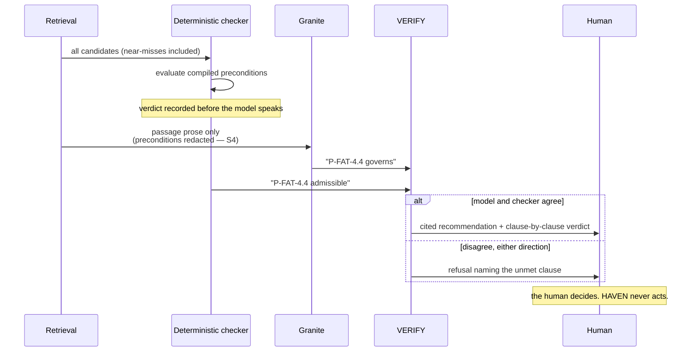
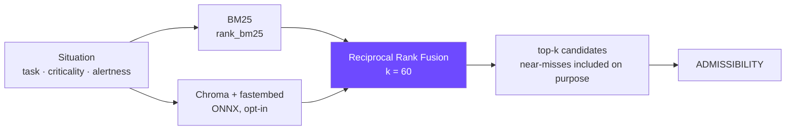
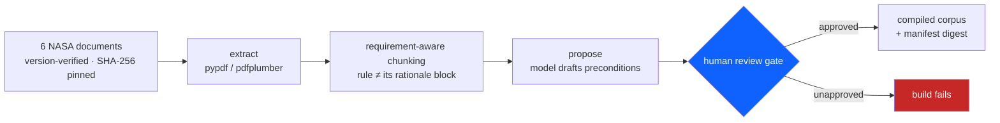
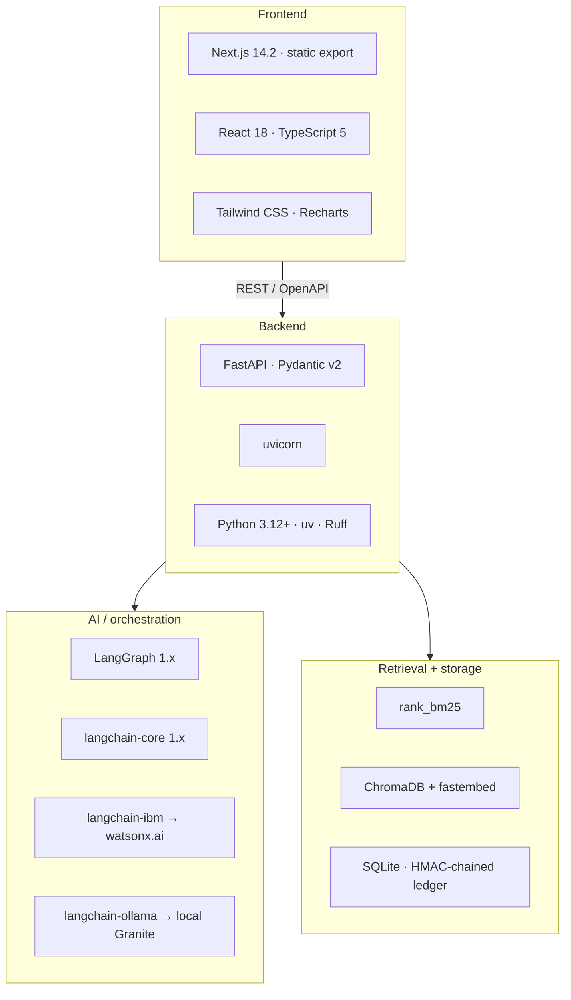

<div align="center">

# HAVEN

### Human Adaptation & Vitality Enhancement Network

**A fatigue-aware safety co-pilot for high-stakes crew decisions.**

*IBM AI Builders Challenge — Space Exploration*

[](https://www.ibm.com/products/watsonx-ai)
[](https://www.ibm.com/granite)
[](https://www.langchain.com/)
[](https://langchain-ai.github.io/langgraph/)
[](#retrieval-and-the-rag-pipeline)
[](https://www.trychroma.com/)

[](https://www.python.org/)
[](https://fastapi.tiangolo.com/)
[](openapi.json)
[](https://nextjs.org/)
[](https://react.dev/)

[](https://github.com/ishaans04/HAVEN/actions/workflows/ci.yml)
[](https://docs.pytest.org/)
[](#testing-and-ci)
[](LICENSE)

</div>

---

## The problem

A fatigued crew member on a long-duration mission is not an edge case. NASA's own
Human Research Program lists *sleep loss, circadian desynchronization and work
overload* as a standing risk to crew performance, and NASA-STD-3001 Volume 1
requires that crew schedule planning include circadian entrainment, work/rest
assessment and fatigue management.

Knowing an operator is impaired is the easy half. The hard half is **what the
procedures say to do about it, right now, for this task** — and that is where a
language model is both the obvious tool and a genuinely dangerous one:

- It will produce an answer even when no procedure governs the situation.
- It will cite the most *similar* rule rather than the one that *applies*.
- It will state a number it computed rather than one that was measured.

Each of those is confidently wrong in exactly the register a tired operator is
least able to challenge. HAVEN is built so that none of them can reach the crew.

> ### The architectural invariant
> The maths owns the numbers. **The compiler owns the rules; the AI proposes; a deterministic checker disposes.** The human owns the decision.
>
> No code path lets the reasoning tier emit a safety-critical figure, cite a rule the checker rejected, or take an irreversible action.

---

## Measured against live IBM watsonx.ai

`ibm/granite-4-h-small`, 20 labelled cases from the golden set
(`uv run --no-sync python -m evaluation.run_eval --provider watsonx`):

<div align="center">

| | Granite alone | **HAVEN** |
|---|:---:|:---:|
| **Accuracy** | 65.0% | **95.0%** |

</div>

| Metric | Result |
|---|---|
| Refusal recall | 100.0% |
| Refusal precision | 90.9% |
| Near-miss rejection | 80.0% |
| **Checker saves** — model wrong, system right | **6** |
| **Unsafe citations** | **0** |
| Provider errors | 0 |
| Median latency | 1,780 ms |

**That thirty-point gap is the architecture, stated as a number.** Granite
proposed the wrong governing rule six times out of twenty. The deterministic
checker caught every one, and not a single incorrect citation reached an
operator. A system that trusted the model's proposal would have shipped six.

Read it in the other direction too: 65% is not a poor model. It is what reading
eleven deliberately-confusable passages actually looks like. The architecture
exists because that number is never going to be 100%.

---

## Quickstart

Dependencies are managed with [uv](https://docs.astral.sh/uv/) (`pip install uv`).
**No API key, model download, database or network connection is required** — the
offline path is a first-class path, and CI asserts it on every push.

```bash
# Setup, once. Name every extra: a bare `uv sync` prunes to the base set.
uv sync --extra providers --extra rag --extra compiler
cd web && npm ci && npm run build && cd ..

# Run
uv run --no-sync python -m scripts.run_haven
```

Open **<http://localhost:8000>**. One process serves the console at `/` and the
API under `/api` from the same origin. Interactive API docs at `/docs`.

> `--no-sync` matters: `uv run` re-syncs before every invocation, and a bare sync
> strips the extras installed above.

**Verify a running instance** — every check in it can fail while the system looks
fine, which is why it exists:

```bash
uv run --no-sync python -m scripts.smoke
```

<details>
<summary><strong>Connecting IBM watsonx.ai</strong></summary>

Copy `.env.example` to `.env` and fill in four values:

| What you have | Variable |
|---|---|
| watsonx API key | `WATSONX_API_KEY` |
| Project ID | `WATSONX_PROJECT_ID` |
| Region URL | `WATSONX_URL` |
| Granite model id | `HAVEN_LLM_MODEL` |
| **Which providers to try** | **`HAVEN_LLM_CHAIN=watsonx,mock`** |

That last row is the one to get right. Without it the chain is `("mock",)`,
watsonx is never attempted, and **no error is raised** — falling through to the
offline stand-in is correct behaviour, which is exactly why a missing chain looks
identical to working credentials.

```bash
uv run --no-sync python -m scripts.check_providers
```

Confirms the credentials are live for a few dozen tokens rather than a full
evaluation sweep, and maps watsonx's several identical-looking authentication
errors onto the one that actually applies.

</details>

<details>
<summary><strong>Docker</strong></summary>

```bash
docker build -t haven .
docker run -p 7860:7860 -v haven-ledger:/data haven
```

The volume keeps the audit ledger across restarts. Port 7860 is what Hugging
Face Spaces expects. *(The Dockerfile is written and its parts are verified
individually; Docker was not installed in the build environment, so the image
itself is unbuilt — see [Honest limits](#honest-limits).)*

</details>

<details>
<summary><strong>Windows and OneDrive</strong></summary>

If the repository lives in a OneDrive-synced folder, `uv sync` can fail partway
with `Access is denied` — OneDrive holds handles open on files uv is replacing,
and a failed sync leaves the environment half-pruned. Installing in place avoids
the prune:

```bash
uv pip install --python .venv/Scripts/python.exe langchain-ibm langchain-ollama
```

An environment constraint, not a repository one: CI runs `uv sync --frozen` on
Linux and is unaffected.

</details>

---

## System architecture

Five tiers with hard boundaries. The arrows that matter are the ones that
**don't** exist: nothing flows from the reasoning tier into the deterministic
one.



Follow the thick path: retrieval hands the model **prose only**, the model
returns a **proposal**, and the deterministic tier — not the model — decides
whether it stands. That loop is the whole design.

### Tier boundaries

| Tier | Owns | Never does |
|---|---|---|
| **Deterministic** | Alertness, workload, sleep debt, circadian phase, every threshold, both screens, **and rule admissibility**. | Any language generation. **Select** a rule — it can only veto one. |
| **Retrieval** | Chunking, embedding, top-k candidates — including confusable near-misses, on purpose. | Decide which candidate governs. |
| **Orchestration + audit** | Sequencing, as a compiled graph; a signed, globally-chained, persistent ledger. | Produce safety numbers or make the final decision. |
| **Reasoning LLM** | **Read passage prose**, propose a governing rule, fuse facts, generate cited text, or refuse. | Invent a number. **See compiled preconditions.** **Promote a passage the checker rejected.** |
| **Presentation** | Rendering and capturing human approval. | Any logic decision. |

---

## The workflow, as a compiled state machine

LangGraph is used as a **finite state machine, not an agent**. The safety
property *is* the fixed, auditable step sequence — a model-chosen, variable-length
tool trajectory would be strictly worse to audit. Every edge is either static or
conditional on a deterministic predicate, and the topology is asserted against a
committed snapshot in CI.



Per raised Situation, a subgraph runs — and this is where propose/dispose lives:



**The model is consulted at exactly three nodes** — SELECT, FUSE, GENERATE (dark
green) — and routes nothing. Every branch (blue) is a deterministic predicate.

Two properties are worth pausing on:

- **ADMISSIBILITY runs before SELECT, and does not filter.** The checker
  evaluates every retrieved candidate *before the model speaks*, and records its
  verdict — but it does not remove the near-misses. Filtering would delete the
  discrimination problem entirely, since a near-miss is inadmissible by
  construction and the whole point is that the model must reject it from prose.
- **CONFIDENCE runs before the model is consulted at all.** When the input data
  is too thin to support a recommendation, nothing is asked of the model. The
  data gap *is* the finding.

### Propose / dispose



Both disagreement directions fail closed, and a passage the model did *not*
select is never promoted. A `governing_passage_id` outside the candidate set is
rejected structurally rather than trusted, because a real model can hallucinate
an identifier.

---

## Retrieval and the RAG pipeline



**BM25 alone is the offline terminal** — no download, no service, no network.
Dense retrieval adds Chroma with fastembed ONNX embeddings (~50 MB, deliberately
not sentence-transformers/PyTorch at ~2 GB) and is opt-in via
`HAVEN_RETRIEVAL_MODE=hybrid`, because it fetches its model on first use and
therefore cannot be part of the offline guarantee.

RRF is implemented directly rather than via LangChain's `EnsembleRetriever`,
which returns fused documents without exposing the fused score — and the console
renders that number.

### The procedure corpus, and where it comes from



Six documents are acquired and compiled to **131 passages**: NASA-STD-3001
Volumes 1 and 2, the Human Integration Design Handbook, and three NTRS papers —
each version-verified against its publisher *before* download, pinned by SHA-256,
and labelled `authoritative`, `guidance` or `research`.

**Only an authoritative requirement may ground an action.** NASA-STD-3001 says
*shall*; the HIDH explains why; a paper reports what was measured. Retrieval
cannot tell them apart, and a BM25 probe over the real documents showed why that
matters: ask about the circadian trough and **all five top hits are research
papers**. Without the authority gate, the query HAVEN's own circadian clause
exists to serve would ground its recommendation in a research paper every time,
with a citation an operator could look up and find.

See [`corpus/README.md`](corpus/README.md) for the full provenance record and
[`corpus/EXTRACTION.md`](corpus/EXTRACTION.md) for what each document yielded.

---

## The eight scenarios

The console renders one Situation across six zones. Eight scenarios drive the
same engine over different inputs — nothing is bypassed or replayed.

| Scenario | What it demonstrates |
|---|---|
| **burn_fatigue** | The core case. Chronic sleep restriction before a reboost burn → cited second-operator verification, staffed. |
| **eva_near_miss** | **Discrimination.** A near-miss retrieves at 0.708 against the governing rule's 0.715 — near-tied on similarity — and is rejected on its preconditions. |
| **no_procedure** | **Refusal.** Nothing governs fatigue during a medical contingency. The system escalates rather than reaching for the nearest plausible rule. |
| **roster_block** | A deterministic screen vetoing a well-formed AI recommendation, then regenerating the text for the fallback the same passage prescribes. |
| **circadian_trap** | An 03:20 capture that passes a sleep-totals check and fails on circadian phase and sleep inertia. |
| **thin_data** | The confidence gate withholding *before* the reasoning tier is invoked. The data gap is the finding. |
| **nominal_ops** | Correct silence. A rested crew raises nothing; the audit bar distinguishes quiet from broken. |
| **provider_outage** | Degraded mode. The provider is unreachable, so the system says so and escalates instead of guessing from the deterministic tier alone. |

[`DEMO.md`](DEMO.md) walks six of them in the order that makes the argument.

---

## The safety model, as tests

Ten hard rules, each with a named enforcement point and a test that **fails when
the protection is removed** — every one verified by deliberately breaking it.

| # | Requirement | Enforced at |
|:--:|---|---|
| **S1** | Numbers are computed, never generated | `assert_no_novel_numbers`, on every completion |
| **S2** | Exactly one of recommendation or refusal — no third, self-actioning state | Graph topology |
| **S3** | No citation, no recommendation — every citation resolves | VERIFY + contract |
| **S4** | The reasoning tier never receives compiled preconditions | `_payload_redacted`, asserted on the rendered prompt |
| **S5** | No citation without independent checker confirmation | VERIFY |
| **S6** | Disagreement fails closed, in both directions | VERIFY |
| **S7** | No entry forgeable without the key; none deletable undetectably | HMAC-SHA256, globally chained ledger |
| **S8** | Every outcome records the corpus manifest it was made under | Ledger + `TierStatus` |
| **S9** | The graph is static — no LLM routes, no tool nodes, no unbounded cycles | Committed topology snapshot |
| **S10** | Only a requirements document may ground an action | `preconditions.check` + compiler review gate |

The **offline guarantee** is executable too: `tests/test_offline_guard.py` imports
the API tier in a subprocess with tracing forced *on* and every socket connection
trapped, and asserts nothing reaches the network.

```bash
uv run pytest tests/test_safety_invariants.py tests/test_offline_guard.py
# 148 passed
```

---

## Technology stack



| Layer | Choice | Why |
|---|---|---|
| **Reasoning** | IBM Granite via **watsonx.ai** (`langchain-ibm`) | IBM's own LangChain package — the integration stays explicit rather than hidden behind a generic gateway |
| **Orchestration** | **LangGraph**, compiled static graph | Topology becomes declarative, inspectable and testable as data |
| **RAG** | LangChain `Document` interchange, BM25 + Chroma, RRF | BM25 keeps the offline path real; dense is additive |
| **API** | **FastAPI** + Pydantic v2 | The contract is the schema; console types are generated from it |
| **Console** | **Next.js 14** static export, **React 18** | Fully client-side, so one FastAPI process serves it from the same origin |
| **Ledger** | SQLite, HMAC-SHA256, globally chained | Tamper-*evident* across trails, not merely per-trail |
| **Tooling** | uv · Ruff · pytest · GitHub Actions | One lockfile, one lint config, three CI jobs |

---

## Repository layout

One repository, no `backend/` and `frontend/` split. The Python package carries
the tier boundaries in its own directory names, so the architecture is legible
from the file tree.

```text
pyproject.toml            dependencies, Ruff, pytest — one file
openapi.json              the exported contract; console types are generated from it
LICENSE                   Apache 2.0
haven/
  offline.py              the offline guarantee, enforced at import time
  config.py               every safety threshold, in one reviewable place
  contracts.py            the locked JSON contract (Pydantic)
  engine.py               binds the adapters and invokes the graph
  api/main.py             FastAPI routes + static console mount
  graph/                  the cycle as a compiled state machine
    evaluation_graph.py   INGEST → SCORE → TRIGGER → SITUATIONS → PRESENT
    situation_graph.py    CONFIDENCE → RETRIEVE → ADMISSIBILITY → SELECT → VERIFY → …
    nodes/                one module per node
  deterministic/          owns every safety number, and admissibility
    three_process_model.py  Åkerstedt & Folkard, published parameters
    nasa_tlx.py             Hart & Staveland weighted formula
    triggers.py             raise a Situation, or archive
    screens.py              confidence gate + schedule impact
    preconditions.py        the checker that disposes of the model's proposal
    projection.py           what the recommended action is predicted to buy
  rag/                    retrieves candidates; decides nothing
    corpus.py               passages, near-misses, one deliberate gap, manifest
    backends.py             BM25 · Chroma + fastembed
    fusion.py               reciprocal rank fusion
    retriever.py            LangChain-shaped retriever interface
  reasoning/              reads, proposes, explains, or refuses
    llm.py                  mock | Ollama | watsonx adapters + numeric guard
    chain.py                provider chain + circuit breaker
    orchestrator.py         what each reasoning step does
    parsing.py              the structured-output ladder
    audit.py                the signed, globally-chained, persistent ledger
  data/                   representative roster, synthetic timelines, scenarios
compiler/                 source PDFs → reviewed passages. Never on the request path
corpus/                   source registry, provenance, extraction report
evaluation/               golden set + measurement harness
web/src/                  the six-zone operator console
tests/                    including the safety invariants
scripts/                  run_haven · smoke · check_providers · fetch_corpus · calibrate
```

---

## Configuration

Every value has a working default; the prototype runs with none of them set.
Copy `.env.example` to `.env` — it is read at startup before any setting
resolves, and an exported shell variable still wins over the file.

| Variable | Default | Purpose |
|---|---|---|
| `HAVEN_LLM_CHAIN` | *(unset)* | Provider chain, e.g. `watsonx,mock`. **This is what switches the tier on.** |
| `HAVEN_LLM_MODEL` | `ibm/granite-3-8b-instruct` | Model id — paste the one your project lists |
| `WATSONX_URL` / `WATSONX_API_KEY` / `WATSONX_PROJECT_ID` | — | watsonx.ai credentials |
| `HAVEN_RETRIEVAL_MODE` | `lexical` | `lexical` (BM25, offline) or `hybrid` (adds Chroma) |
| `HAVEN_CORPUS` | *(unset)* | Path to a compiled corpus artefact |
| `HAVEN_LEDGER_DB` / `HAVEN_AUDIT_KEY` | auto | Ledger location and signing key |

---

## Testing and CI

```bash
uv run pytest                      # 737 tests
uv run pytest -m integration       # requires a local Ollama
uv run pytest -m live              # requires watsonx credentials
```

Provider- and service-backed tests are excluded by default, so a clean checkout
runs green with no Ollama and no watsonx credentials.

Three CI jobs, each proving something the others cannot:

| Job | Proves |
|---|---|
| **Engine** | Base install, no extras — the offline path is real. Lint, format, full suite, offline guard, corpus provenance, scenario calibration, evaluation gate |
| **Full** | Every extra installed — nothing was lost to the offline constraint |
| **Contract** | Generated TypeScript has not drifted from `openapi.json`; the console builds |

The evaluation harness runs in CI and **fails the build on a single unsafe
citation**.

---

## Honest limits

Named explicitly, because the system's whole thesis is that flagging uncertainty
beats asserting false confidence.

**Real, executing live on every evaluation:** the Three-Process Model and
NASA-TLX with their published parameters; retrieval; model-proposed and
checker-verified rule selection; the refusal path; both deterministic screens;
forward projection; and a persistent HMAC-signed, globally-chained ledger. The
watsonx integration is measured, not asserted — see the results above.

**Simulated, and labelled in the UI:**

- **The crew roster is representative, not real individuals.** Attaching modelled
  fatigue states to identifiable astronauts would be the wrong default even in a
  demo. Substituting a public roster is a data change in `haven/data/crew.py`.
- **Sleep, duty and task timelines are synthetic.** No public live crew-timeline
  feed exists. The structure follows NASA scheduling literature; values are
  generated from explicit per-night parameters, so every scenario is reproducible.
- **The corpus reasoned over at runtime is still the hand-authored one.** The 131
  compiled NASA passages await human review, and the emit gate refuses without a
  named reviewer — which is it working. The hand-authored passages follow NASA
  flight-rule numbering and precondition style; the prose is not verbatim NASA
  procedure, and every passage carries its provenance *and* its authority.

**Design standards are not execution rules — and now there is evidence.** This
was recorded as a risk before any document was read. NASA-STD-3001 Volume 2
carries 1,579 requirements; fifty-one mention sleep, fatigue or workload; **not
one** says what to do when an operator is below threshold thirty minutes before a
burn. The standards require that a *system* provide sleep accommodation, that a
*programme* establish work-hour limits, that a *schedule* include fatigue
management. The execution-time gating layer remains synthesised and is labelled
as such everywhere it surfaces.

**The audit ledger is tamper-evident, not tamper-proof.** Entries are signed with
HMAC-SHA256 and chained globally across every trail, so an entry cannot be
rewritten and a whole trail cannot be deleted without the key — either leaves a
break the ledger reports, with the sequence number where it happened. What that
does *not* stop is an attacker holding the signing key **and** write access.
Closing that needs storage the attacker cannot reach — WORM media, or an external
notary — which this build does not have. A test asserts this limit explicitly
rather than leaving it implied.

**Not verified here:** the Docker image is unbuilt (Docker was not installed in
the build environment) and the Ollama adapter has no live run (no local Granite
on this machine) — it is covered by unit tests and the provider chain only.

**Deferred:** the closed verification loop — confirming after the fact that
alertness and coverage actually improved — needs a time-simulation layer beyond
this build. Named rather than half-built.

---

## Documentation

| Document | Contents |
|---|---|
| [`DEMO.md`](DEMO.md) | Six-scenario walkthrough, ~8 minutes, ordered so each answers the doubt the last raises |
| [`corpus/README.md`](corpus/README.md) | The NASA source documents, version verification, and the authority model |
| [`corpus/EXTRACTION.md`](corpus/EXTRACTION.md) | What the compiler read from each document, and what retrieval finds in it |
| [`CHANGELOG.md`](CHANGELOG.md) | Every phase, what it decided, and what was deliberately *not* done |

---

## License

Licensed under the **Apache License, Version 2.0** — see [`LICENSE`](LICENSE).

NASA source documents referenced by the corpus are US Government works cleared
for public release; they are not redistributed in this repository. See
[`corpus/README.md`](corpus/README.md).

---

<div align="center">

*The deterministic tier owns all safety numbers. The AI reasoning tier reads, proposes, explains, or refuses.*
*A deterministic checker disposes. **The human owns every decision.***

</div>
