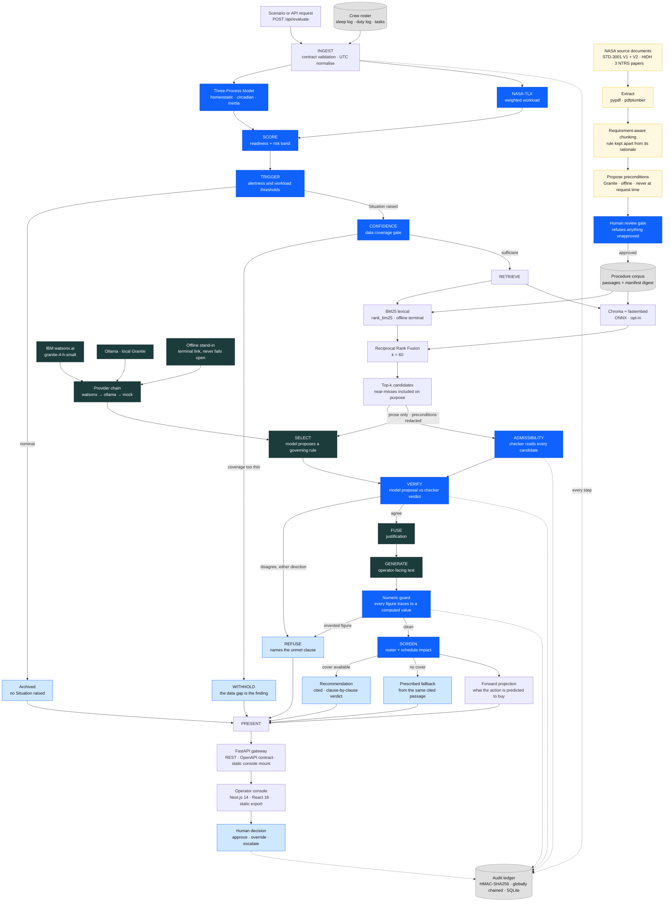

<div align="center">

# HAVEN

### Human Adaptation & Vitality Enhancement Network

**A fatigue-aware safety co-pilot for high-stakes crew decisions.**

*The maths owns the numbers. The compiler owns the rules.*
*The AI proposes; a deterministic checker disposes. The human owns the decision.*

<br/>

[](https://www.ibm.com/products/watsonx-ai)
[](https://www.ibm.com/granite)
[](https://www.langchain.com/)
[](https://langchain-ai.github.io/langgraph/)
[](#retrieval-and-the-rag-pipeline)
[](https://www.trychroma.com/)

[](https://www.python.org/)
[](https://fastapi.tiangolo.com/)
[](openapi.json)
[](https://nextjs.org/)
[](https://react.dev/)

[](https://github.com/ishaans04/HAVEN/actions/workflows/ci.yml)
[](https://docs.pytest.org/)
[](#testing-and-ci)
[](LICENSE)

</div>

---

## Why HAVEN?

A fatigued crew member on a long-duration mission is not an edge case. NASA's
Human Research Program maintains a standing evidence report on *sleep loss,
circadian desynchronization and work overload* as a risk to crew performance, and
NASA-STD-3001 Volume 1 requires that crew schedule planning include circadian
entrainment, work/rest assessment and fatigue management.

Detecting that an operator is impaired is the easy half. Sleep debt, circadian
phase and workload are well studied and computable. The hard half is the question
that follows immediately:

> **What do the procedures require us to do about it — right now, for this task,
> for this crew member?**

That is what a language model looks perfectly suited to answer, and it is exactly
where a language model is dangerous. Three failure modes, all of them confident:

| Failure | What it looks like |
|---|---|
| **It answers when nothing governs** | No procedure covers fatigue during a medical contingency, so the model reaches for the closest rule and presents it as the governing one. |
| **It cites the most *similar* rule, not the one that *applies*** | A pre-EVA sleep-shifting protocol shares almost every keyword with the EVA fatigue rule — and is scoped to *planning*, not execution. |
| **It states a number it computed** | Given alertness 0.65 and a threshold of 0.70, it writes "a shortfall of 0.05" — a figure no instrument measured and no model was given. |

Each is wrong in the register a tired operator is least able to challenge:
fluent, cited, specific. HAVEN is built so none of them can reach the crew — not
by asking the model to be more careful, but by making it structurally unable to
be the last word.

---

## What makes HAVEN different?

Most retrieval-augmented systems are a pipeline: retrieve, prompt, return. The
model is the last component, so whatever it says *is* the answer. HAVEN inverts
that — the model's output is an **input** to a deterministic component that can
overrule it.

| | Typical RAG assistant | HAVEN |
|---|---|---|
| **Who decides which rule applies** | The model. Retrieval ranks, the model picks, the pick ships. | The model **proposes**; a deterministic checker evaluates the rule's compiled preconditions independently and can veto. |
| **Numbers in the answer** | Whatever the model writes. | Every numeral must trace to a value the deterministic tier computed. A violation is caught, repaired once, then **refused**. |
| **When nothing applies** | Returns the nearest match, confidently. | **Refusal is a first-class output** — it records what was searched, the closest candidate, and escalates. |
| **Near-misses in retrieval** | Filtered out to improve precision. | **Deliberately kept.** Filtering would delete the discrimination problem rather than solve it. |
| **Source authority** | All retrieved text is equally citable. | A standard says *shall*, a handbook says *should*, a paper reports a measurement. **Only a requirement may ground an action.** |
| **Orchestration** | An agent loop; variable-length tool trajectory. | A **compiled static state machine.** No LLM routes, no cycles, topology asserted against a committed snapshot. |
| **Audit** | Logs, if any. | Every step written to an **HMAC-signed, globally chained ledger**; every decision records the corpus digest it was made under. |
| **Provider failure** | An error, or a silent fallback. | Falls through a provider chain and **says so** — `degraded: true`, and the console names the link that answered. |

The measurable consequence is below: on the same twenty cases, Granite alone is
right 65% of the time and HAVEN is right 95% of the time. The difference is not a
better prompt. It is the checker.

---

## What AI does vs what HAVEN enforces

The single most important thing to understand about this system: **the LLM is
never the final safety decision-maker.** It is a reader and a writer. Everything
that can harm a crew member is decided by deterministic code that the model
cannot see, reach, or influence.

| | 🤖 The reasoning LLM (IBM Granite) | ⚙️ The deterministic safety layer |
|---|---|---|
| **Interprets prose** — reads passage text and judges which rule its own wording claims to govern | ✅ **yes** | ❌ never — it cannot read |
| **Proposes** a governing rule | ✅ **yes** — as a *proposal* only | ❌ never — it can only confirm or veto |
| **Fuses context** into a single justification | ✅ **yes** — it writes, it does not choose | ❌ — |
| **Generates** the operator-facing explanation | ✅ **yes** | ❌ — |
| **Refuses** when nothing fits | ✅ **yes** — naming none is a valid answer | ✅ **yes** — and it overrides the model |
| **Computes every safety number** — alertness, workload, sleep debt, circadian phase | ❌ **never** | ✅ Three-Process Model + NASA-TLX |
| **Decides rule admissibility** — are the compiled preconditions actually satisfied? | ❌ **never sees them** (S4) | ✅ `preconditions.check` |
| **Verifies the citation** resolves to a real passage | ❌ — | ✅ VERIFY + contract (S3) |
| **Enforces thresholds** and the two screens | ❌ — | ✅ `config.THRESHOLDS` |
| **Chooses the prescribed action** | ❌ — the action is `passage.prescribes` | ✅ read from the corpus |
| **Routes the state machine** | ❌ **never** — no LLM-decided edges (S9) | ✅ one boolean, read from state |
| **Disposition on disagreement** | ❌ — | ✅ **fails closed, in both directions** |

### What that means in practice

**The model is handed prose and nothing else.** At SELECT it receives
`passage_id`, `doc`, `section`, `title`, `text` — the compiled `applies_when`
clauses that actually settle the question are redacted from every prompt.

**Its answer is an input, not an output.** VERIFY compares the model's proposal
against the checker's independent verdict:

| Model said | Checker says | Result |
|---|---|---|
| passage **P** | P admissible | ✅ proceed |
| passage **P** | P inadmissible | 🛑 **refuse** — names the unmet clause |
| nothing | something admissible | 🛑 **refuse** — logs the disagreement |
| nothing | nothing admissible | 🛑 **refuse** — no governing procedure |

**Three of those four rows are refusals**, and a passage the model did *not*
select is never promoted — a checker that could hand back a rule nobody read
would be the same system with the tiers swapped, not a safer one.

**Even when the model is right, it cannot write a number.** Every numeral in
generated text is checked against the set of values the deterministic tier
computed. One violation gets a single correction attempt with the offending
figure named; a second withholds the recommendation entirely.

**And the maths can still overrule a correct answer.** The two deterministic
screens — data confidence and schedule impact — can downgrade or block a
well-formed, correctly cited recommendation. Neither can ever *create* one.

> **In one line:** the AI decides what to *say*; the deterministic layer decides
> what is *true*, what is *allowed*, and what an operator is actually shown.

---

## The core idea in one example

The `eva_near_miss` scenario, start to finish. Every number below is from the
running system.

**The situation.** A suited crew member is assigned an EVA. The deterministic
tier computes predicted alertness **0.65** against an execution threshold of
**0.70**, task criticality **high**. A Situation is raised.

**Retrieval returns four candidates.** Two matter:

| Passage | Document | Relevance | What it is |
|---|---|:--:|---|
| `P-SLP-2.1` | OPS-SLEEP-02 §2.1 | **0.984** | Pre-extravehicular **sleep-shifting protocol** |
| `P-FAT-4.4` | OPS-FATIGUE-04 §4.4 | **0.968** | Extravehicular activity with **degraded crew alertness** |

Note the order. **The near-miss outranks the rule that actually governs** — and
the governing rule is only third of the four returned. Both are EVA-scoped, both
discuss sleep and extravehicular activity, and lexical similarity cannot separate
them. A pipeline that trusted retrieval ranking would cite `P-SLP-2.1`.

**The checker reads both, before the model speaks.** Their compiled preconditions
are not similar at all:

```text
P-SLP-2.1   applies_when: { task_types: [eva], phase: "planning" }
            prescribes:   null
            phase is "execution", not "planning"      FAIL
            states no action a fatigue decision can take
            -> INADMISSIBLE

P-FAT-4.4   applies_when: { task_types: [eva],
                            alertness_below: 0.70,
                            criticality_in: [high, medium] }
            prescribes:   short_rest_then_proceed
            authority "prototype" may prescribe       OK   ← checked first
            eva = eva                                 OK
            high is in [high, medium]                 OK
            0.65 is below 0.70                        OK
            -> ADMISSIBLE
```

**The model never sees any of that.** It receives passage prose only —
`passage_id`, `doc`, `section`, `title`, `text`. No preconditions, no prescribed
action, no near-miss annotation. It has to read `P-SLP-2.1` and notice that its
own wording scopes it to planning days before egress. Live Granite proposes
**`P-FAT-4.4`**.

**VERIFY compares the two verdicts.** Model says `P-FAT-4.4`; checker says
`P-FAT-4.4` is admissible. They agree, so the recommendation stands — and it
carries the checker's clause-by-clause verdict with it, so an operator can audit
the citation rather than trust it.

**What live Granite actually wrote:**

> *Alertness is below the extravehicular execution threshold. The task is high
> criticality. Therefore, extravehicular activity shall not commence.*

No arithmetic, no invented figure. An earlier run of this exact scenario produced
*"the shortfall of 0.05"* — Granite had computed `0.70 − 0.65` — and the numeric
guard **refused the entire recommendation** rather than publish it.

That was the guard working; the *prompt* was the defect. "Use only the numbers
given" is satisfiable by a model that subtracts two of them, because in its own
terms it introduced nothing and derived something. The prompts now forbid the
**operation**, not merely the output. The guard is byte-for-byte unchanged, and a
test asserts that separately — because the temptation under a live failure is to
relax it.

**Had the model proposed `P-SLP-2.1` instead**, the checker would have rejected
it on the `phase` clause and HAVEN would have returned a refusal naming that
clause. The wrong answer is unreachable from either direction.

---

## Measured against live IBM watsonx.ai

`ibm/granite-4-h-small`, 20 labelled cases from the golden set
(`uv run --no-sync python -m evaluation.run_eval --provider watsonx`):

<div align="center">

| | Granite alone | **HAVEN** |
|---|:---:|:---:|
| **Accuracy** | 65.0% | **95.0%** |

</div>

| Metric | Result |
|---|---|
| Refusal recall | 100.0% |
| Refusal precision | 90.9% |
| Near-miss rejection | 80.0% |
| **Checker saves** — model wrong, system right | **6** |
| **Unsafe citations** | **0** |
| Provider errors | 0 |
| Median latency | 1,780 ms |

**That thirty-point gap is the architecture, stated as a number.** Granite
proposed the wrong governing rule six times out of twenty. The deterministic
checker caught every one, and not a single incorrect citation reached an
operator. A system that trusted the model's proposal would have shipped six.

Read it in the other direction too: 65% is not a poor model. It is what reading
eleven deliberately confusable passages actually looks like. The architecture
exists because that number is never going to be 100%.

*Model accuracy* is what the provider proposed. *System accuracy* is what HAVEN
did, after VERIFY disposed of that proposal. The second is the requirement.

---

## Run it locally

HAVEN runs as a **single local process**. One `uvicorn` serves the console at `/`
and the REST API under `/api` from the same origin — one port, nothing to
configure, no CORS.

**No API key, model download, database or network connection is required.** The
offline path is a first-class path, and CI asserts it on every push. watsonx
credentials upgrade the reasoning tier; they are not a prerequisite for running.

### Prerequisites

- **Python 3.12–3.14** and [`uv`](https://docs.astral.sh/uv/) (`pip install uv`)
- **Node 20+**, to build the console once
- *Optional:* IBM watsonx.ai credentials, to run the reasoning tier live

### Quickstart

```bash
git clone https://github.com/ishaans04/HAVEN.git
cd HAVEN

# Setup, once. Name every extra: a bare `uv sync` prunes to the base set.
uv sync --extra providers --extra rag --extra compiler
cd web && npm ci && npm run build && cd ..

# Run
uv run --no-sync python -m scripts.run_haven
```

Open **<http://localhost:8000>** — the landing page at `/`, the operator console
at `/console`, interactive API docs at `/docs`.

> `--no-sync` matters: `uv run` re-syncs before every invocation, and a bare sync
> strips the extras installed above.

The launcher prints a preflight before serving, because every failure it catches
is otherwise silent — a missing console export does not stop the API starting,
and a provider chain that fell through to the offline stand-in is *correct*
behaviour:

```text
console      built, serving from web/out
reasoning    watsonx -> mock  (ibm/granite-4-h-small)
corpus       11 passages, manifest 3fdc22371029...
```

Flags: `--host`, `--port 8080`, `--reload`, `--skip-checks`.

**Verify a running instance.** Every check in it can fail while the system looks
fine, which is why it exists:

```bash
uv run --no-sync python -m scripts.smoke
```

It drives the server over HTTP exactly as the console does, so what it verifies
is the assembled system rather than the parts: which provider actually answered,
citation resolution, refusal integrity, the authority gate, and the ledger chain.

<details>
<summary><strong>Connecting IBM watsonx.ai</strong></summary>

Copy `.env.example` to `.env` and fill in five values. The file is read at
startup by `haven/__init__.py` *before* any setting resolves, and an exported
shell variable still wins over it. `.env` is gitignored.

| What you have | Variable |
|---|---|
| watsonx API key | `WATSONX_API_KEY` |
| Project ID | `WATSONX_PROJECT_ID` |
| Region URL | `WATSONX_URL` — e.g. `https://us-south.ml.cloud.ibm.com` |
| Granite model id | `HAVEN_LLM_MODEL` — e.g. `ibm/granite-4-h-small` |
| **Which providers to try** | **`HAVEN_LLM_CHAIN=watsonx,mock`** |

That last row is the one to get right. Without it the chain is `("mock",)`,
watsonx is never attempted, and **no error is raised** — falling through to the
offline stand-in is correct behaviour, which is exactly why a missing chain looks
identical to working credentials.

`WATSONX_URL` must match the region the project lives in: a key valid in
`us-south` returns 401 against `eu-de`, which reads as a bad key and is not.
watsonx model ids also change between releases, so paste the one your project
lists rather than trusting a default.

```bash
uv run --no-sync python -m scripts.check_providers            # one small live call
uv run --no-sync python -m scripts.check_providers --no-call  # config only, zero tokens
```

It masks the key in its output, names `uv sync --extra providers` if
`langchain_ibm` is missing, shows the resolved chain so `("mock",)` is visible as
the problem it is, and maps watsonx's several identical-looking authentication
errors onto the one that actually applies — wrong key, wrong region, wrong
project, unknown model id, or exhausted quota.

</details>

<details>
<summary><strong>Windows and OneDrive</strong></summary>

If the repository lives in a OneDrive-synced folder, `uv sync` can fail partway
with `Access is denied` — OneDrive holds handles open on files uv is replacing,
and a failed sync leaves the environment half-pruned. Installing in place avoids
the prune:

```bash
uv pip install --python .venv/Scripts/python.exe langchain-ibm langchain-ollama
```

An environment constraint, not a repository one: CI runs `uv sync --frozen` on
Linux and is unaffected. Always start with `uv run --no-sync ...` afterwards.

</details>

<details>
<summary><strong>Developing the console with hot reload</strong></summary>

```bash
uv run --no-sync python -m scripts.run_haven                        # API on :8000
cd web && NEXT_PUBLIC_API_BASE=http://localhost:8000 npm run dev    # console on :3000
```

Run `npm run build` again before demonstrating, so the export FastAPI serves is
current. The launcher compares the export's timestamp against `web/src` and warns
when it is stale.

</details>

### Confirming watsonx is live, not the mock

A chain that fell through to the offline stand-in still returns a perfectly
well-formed, correctly cited recommendation. **Only the tier status tells you.**

```bash
curl -s localhost:8000/api/health          # reasoning_provider: "watsonx -> mock"
uv run --no-sync python -m scripts.smoke   # asserts which link actually answered
```

`/api/health` reports the *configured chain*; `served_by` on each evaluation
reports the link that answered. In the console, the audit strip names it and
highlights that link in the chain.

### The offline and mock fallback

The **terminal link of the chain is always the mock**, which is what makes "the
reasoning tier is unavailable" a state the system can be in rather than a crash.
A circuit breaker — 3 consecutive failures, a 30-second cooldown, then a single
probe — stops a dead link from costing its timeout on every call.

Falling back is **loud, never silent**:

```text
served_by       : mock-granite
degraded        : True
degraded_reason : watsonx: WATSONX_API_KEY and WATSONX_PROJECT_ID must be set
outcome         : recommendation | P-FAT-4.4
```

Set `HAVEN_LLM_CHAIN=mock`, or leave it unset, and the whole system runs with **no
network at all**: the deterministic tier, BM25 retrieval, the checker, both
screens, the forward projection and the signed ledger are real and offline. Only
the live-model claim is lost.

That guarantee is executable rather than asserted — `tests/test_offline_guard.py`
imports the API tier in a subprocess with tracing forced *on* and every socket
connection trapped, then asserts nothing reaches the network.

---

## System architecture

Five tiers with hard boundaries. **Blue** is deterministic, **dark green** is the
reasoning tier, **amber** is the offline corpus compiler, **grey** is durable
storage. The two edges that matter most both leave retrieval: the checker
receives the **compiled preconditions**, the model receives the **prose only**.



### Tier boundaries

| Tier | Owns | Never does |
|---|---|---|
| **Deterministic** | Alertness, workload, sleep debt, circadian phase, every threshold, both screens — **and rule admissibility**. | Any language generation. **Select** a rule; it can only veto one. |
| **Retrieval** | Chunking, indexing, top-k candidates — including confusable near-misses, on purpose. | Decide which candidate governs. |
| **Orchestration + audit** | Sequencing, as a compiled graph; a signed, globally-chained, persistent ledger. | Produce safety numbers, or make the final decision. |
| **Reasoning LLM** | **Read passage prose**, propose a governing rule, fuse facts, generate cited text, or refuse. | Invent a number. **See compiled preconditions.** **Promote a passage the checker rejected.** |
| **Presentation** | Rendering, and capturing human approval. | Any logic decision. |

---

## The core workflow

LangGraph is used as a **compiled finite state machine, not an agent**. The safety
property *is* the fixed, auditable step sequence: a model-chosen path cannot be
audited in advance, so the model chooses no paths. There are no LLM-decided
routes, no tool nodes and no unbounded cycles — and the compiled topology is
snapshotted in the repository, so a change to the graph's shape fails a test
rather than shipping quietly.

Two graphs. The outer one runs once per request:

```text
INGEST → SCORE → TRIGGER → SITUATIONS → PRESENT
```

The inner one runs once per raised Situation:

```text
CONFIDENCE ──┬── coverage too thin ──→ WITHHOLD ─────────────────────→ END
             │
             └── sufficient ──→ RETRIEVE → ADMISSIBILITY → SELECT → VERIFY
                                                                      │
                             ┌──── agree ────┬──── disagree ──────────┘
                             ↓               ↓
                           FUSE            REFUSE
                             ↓               │
                         GENERATE            │
                             │               │
                             └───────┬───────┘
                                     ↓
                                  SCREEN ───────────────────────────→ END
```

`WITHHOLD` bypasses `SCREEN` entirely: there is no recommendation to screen, and
the data gap *is* the finding.

### Propose / dispose

The middle three nodes are where the invariant lives.

**ADMISSIBILITY** runs the deterministic checker over *every* retrieved
candidate, before the model has spoken. It deliberately does **not filter** the
candidate set — filtering would delete the near-miss discrimination case
entirely, since a near-miss is inadmissible by construction and the whole point
is that the model must reject it from prose. Its purpose is to put on the record
what the checker independently believes, so agreement or disagreement is a
recorded fact rather than a later inference.

**SELECT** is the model's proposal, made from redacted prose only.

**VERIFY** is the disposition, and it is deterministic:

| Model said | Checker says | Result |
|---|---|---|
| passage **P** | P admissible | proceed to FUSE |
| passage **P** | P inadmissible | **refuse**, naming the unmet clause |
| nothing | something admissible | **refuse**, logging the disagreement |
| nothing | nothing admissible | **refuse** — no governing procedure |

Both disagreement directions fail closed. A `governing_passage_id` outside the
candidate set is rejected structurally rather than trusted, because a real
provider can hallucinate an identifier.

There is **no relevance gate on this path.** An earlier version compared a
similarity float against a threshold and called the result a decision; a
similarity score is a property of wording, not a judgement about whether a rule
applies. Relevance now ranks candidates and is displayed, and nothing branches on
it — a test scans the package and enforces that.

---

## Retrieval and the RAG pipeline

Two backends, fused by reciprocal rank:

- **BM25** (`rank_bm25`, Okapi) is lexical and is the **offline terminal** — no
  download, no service, no network. It is a base dependency rather than an
  extra, because the offline guarantee depends on it.
- **Dense** retrieval adds ChromaDB with fastembed ONNX embeddings (~50 MB,
  deliberately not sentence-transformers/PyTorch at ~2 GB). Opt in with
  `HAVEN_RETRIEVAL_MODE=hybrid`. It fetches its model on first use and therefore
  cannot be part of the offline guarantee; when unavailable the tier degrades to
  BM25 alone and records why.
- **Reciprocal Rank Fusion** (k = 60) combines them. Implemented directly rather
  than via LangChain's `EnsembleRetriever`, which returns fused documents without
  exposing the fused score — and the console renders that number.

The index sees **title and text only.** Compiled preconditions never enter it,
which is safety requirement S4 arrived at from a second direction.

### The procedure corpus, and where it comes from

The corpus compiler turns source PDFs into passages carrying machine-checkable
preconditions, under human review. It runs **offline and never at request time** —
a test asserts that nothing under `haven/` imports it.

```text
NASA PDFs → extract → requirement-aware chunk → propose → HUMAN REVIEW → emit
                                                              │
                                                              └─ unapproved → build fails
```

Six documents are acquired and extracted to **131 passages**: NASA-STD-3001
Volumes 1 and 2, the Human Integration Design Handbook, and three NTRS papers —
each version-verified against its publisher *before* download, pinned by SHA-256,
and labelled `authoritative`, `guidance` or `research`. A checksum mismatch is
**refused, not warned about**: a standards body replacing a PDF in place is how a
corpus silently becomes a corpus of a different revision, with every decision
under it citing section numbers that have moved.

**Only an authoritative requirement may ground an action.** A BM25 probe over the
real documents showed why that matters: ask about the circadian trough and *all
five top hits are research papers*. Without the authority gate, the query HAVEN's
own circadian clause exists to serve would ground its recommendation in a
research paper every time — with a citation an operator could look up and find.

| Class | Source | Says | May ground an action? |
|---|---|---|:--:|
| `authoritative` | NASA-STD-3001 | *shall* | **yes** |
| `prototype` | hand-authored, stands in for a flight rule | *shall* | **yes**, and is labelled simulated everywhere |
| `guidance` | HIDH | *should* | no — retrievable, readable, never binding |
| `research` | NTRS papers | *was measured* | no — evidence for a rule, never the rule |

**What runs at request time today is the hand-authored corpus** — 11 passages
labelled `prototype`, following NASA flight-rule numbering and precondition
style. The 131 extracted NASA passages await a named human reviewer, and the emit
gate refuses without one. That is the pipeline working, not failing; see
[`corpus/README.md`](corpus/README.md) for the full account.

---

## The eight scenarios

Eight scenarios drive the same engine over different inputs — nothing is bypassed
or replayed. Select any of them in the console, or over the API.

| Scenario | What it demonstrates |
|---|---|
| **`burn_fatigue`** | **The core case.** Chronic sleep restriction before a reboost burn → cited second-operator verification, staffed. |
| **`eva_near_miss`** | **Discrimination.** The near-miss retrieves at 0.984, *above* the governing rule's 0.968; the system cites the right one anyway. |
| **`no_procedure`** | **Refusal.** Nothing governs fatigue during a medical contingency, so the system escalates rather than reaching for the nearest plausible rule. |
| **`roster_block`** | A deterministic screen vetoing a well-formed AI recommendation, then regenerating the text for the fallback the same passage prescribes. |
| **`circadian_trap`** | An 03:20 capture that passes a sleep-totals check and fails on circadian phase and sleep inertia. |
| **`thin_data`** | The confidence gate withholding *before* the reasoning tier is invoked. The data gap is the finding. |
| **`nominal_ops`** | **Correct silence.** A rested crew raises nothing; the audit strip distinguishes quiet from broken. |
| **`provider_outage`** | **Degraded mode.** The provider is unreachable, so the system says so and escalates instead of guessing from the deterministic tier alone. |

[`DEMO.md`](DEMO.md) walks six of them in the order that makes the argument, in
about eight minutes.

---

## The safety model, as tests

Ten hard rules, each with a named enforcement point and a test that **fails when
the protection is removed** — every one verified by deliberately breaking it.

| # | Requirement | Enforced at |
|:--:|---|---|
| **S1** | Numbers are computed, never generated | `assert_no_novel_numbers`, on every completion |
| **S2** | Exactly one of recommendation or refusal — no third, self-actioning state | Graph topology |
| **S3** | No citation, no recommendation — and every citation resolves | VERIFY + contract |
| **S4** | The reasoning tier never receives compiled preconditions | `_payload_redacted`, asserted on the rendered prompt |
| **S5** | No citation without independent checker confirmation | VERIFY |
| **S6** | Disagreement fails closed, in both directions | VERIFY |
| **S7** | No entry forgeable without the key; none deletable undetectably | HMAC-SHA256, globally chained ledger |
| **S8** | Every outcome records the corpus manifest it was made under | Ledger + `TierStatus` |
| **S9** | The graph is static — no LLM routes, no tool nodes, no unbounded cycles | Committed topology snapshot |
| **S10** | Only a requirements document may ground an action | `preconditions.check` + compiler review gate |

S4 is the invariant most easily lost in a later refactor — the leak is a one-word
change at a call site, and nothing else fails — so it is asserted three ways: on
what the provider was actually handed, on the rendered prompt in the sealed audit
trail, and on the shape of the payload.

```bash
uv run --no-sync pytest tests/test_safety_invariants.py tests/test_offline_guard.py
# 152 passed
```

### The audit ledger

Every step of every evaluation is appended to a SQLite ledger with an
**HMAC-SHA256** tag chained to the previous entry. The trail records inputs and
outputs, not just outcomes, so a reviewer can reconstruct why a recommendation
was made — or why it was refused.

The chain is **global, not per-trail**: each entry links to whatever was written
before it *anywhere* in the ledger, so removing an entire trail breaks the links
either side of the hole. Under per-trail chains a whole trail could be deleted
undetectably, because nothing recorded that it had ever existed.

Keying the chain is what separates *corruption* from *tampering*. An unkeyed
digest catches a field edited in place with a stale hash; it cannot catch an
entry rewritten and re-digested, because anyone can recompute an unkeyed digest.
The signing key is generated on first use, so a fresh clone with no configuration
simply works.

---

## REST API

Eight routes, contract-first. `openapi.json` is exported by a script and
committed, and the console's TypeScript types are generated from it — so a
contract change not mirrored on the other side fails CI within one run instead of
at runtime.

| Method | Path | Purpose |
|---|---|---|
| `GET` | `/api/health` | Live tiers, resolved provider chain, model id, active thresholds |
| `GET` | `/api/scenarios` | The eight scenarios |
| `GET` | `/api/scenarios/{id}/evaluate` | Evaluate a named scenario |
| `POST` | `/api/evaluate` | Evaluate an arbitrary crew and task window |
| `GET` | `/api/procedures` | The corpus, with provenance and authority per passage |
| `GET` | `/api/audit/{audit_ref}` | The full signed trail behind one Situation |
| `POST` | `/api/decisions` | **Stage 7** — record the human decision |
| `GET` | `/api/decisions` | Recorded decisions |

`POST /api/decisions` is the point of the whole system. HAVEN never actions
anything itself, so the operator's approval, override or escalation is captured,
appended to the trail, and re-sealed.

---

## Technology stack

| Layer | Technology | Why it is here |
|---|---|---|
| **Frontend** | **Next.js 14** (static export) | The console is entirely client-side, so there is no SSR to give up — and one process beats two |
| | **React 18** + TypeScript | Types generated from `openapi.json`, never hand-maintained |
| | Tailwind CSS 3 | Utility styling for a dense instrument panel |
| | Recharts · lucide-react | The alertness curve and task timeline; icons |
| **Backend** | **FastAPI 0.115+** | OpenAPI 3.1 for free, and it mounts the static console from the same origin |
| | Uvicorn | ASGI server; endpoints are sync `def`, so a slow evaluation never blocks the event loop |
| | Pydantic v2 | The locked contract — validation *is* the schema |
| **Orchestration** | **LangGraph 1.x** | A compiled state machine with a snapshotted topology, not an agent |
| | **LangChain Core 1.x** | Document and retriever interfaces, without the sunset `community` package |
| **Reasoning** | **IBM watsonx.ai** via `langchain-ibm` | Granite, through IBM's own package, so the integration stays explicit |
| | Ollama via `langchain-ollama` | Local Granite, for free unmetered iteration |
| | Mock provider | Scripted stand-in; the terminal chain link, so a run can never fail open |
| **Retrieval** | **`rank_bm25`** (Okapi BM25) | Lexical, and the offline terminal — a base dependency, not an extra |
| | **ChromaDB** + fastembed (ONNX) | Optional dense retrieval at ~50 MB rather than ~2 GB |
| | Hand-written RRF (k = 60) | `EnsembleRetriever` hides the fused score, and the console renders it |
| **Deterministic** | NumPy | Three-Process Model (Åkerstedt & Folkard) and NASA-TLX (Hart & Staveland), published parameters |
| **Data & audit** | SQLite + `hmac` / `hashlib` | Globally chained, HMAC-SHA256-signed ledger; no ORM, no server |
| | `python-dotenv` | Reads `.env` before any setting resolves; pure Python, opens no socket |
| **Corpus compiler** | `pypdf` · `pdfplumber` · `langchain-text-splitters` | Called directly, so page provenance stays under control |
| **Tooling** | **`uv`** | Locked, reproducible environments and fast resolution |
| | **Ruff** | Lint and format in one tool, configured in `pyproject.toml` |
| **Testing** | **pytest 8** + Hypothesis | 737 tests, including the ten safety invariants and property-based checks |
| **CI** | **GitHub Actions** | Three jobs — the offline path, every extra, and contract drift |

---

## Repository layout

One repository, no `backend/` and `frontend/` split. The Python package carries
the tier boundaries in its own directory names, so the architecture is legible
from the file tree.

```text
pyproject.toml            dependencies, Ruff, pytest — one file
openapi.json              the exported contract; console types are generated from it
LICENSE                   Apache 2.0
haven/
  offline.py              the offline guarantee, enforced at import time
  config.py               every safety threshold, in one reviewable place
  contracts.py            the locked JSON contract (Pydantic)
  engine.py               binds the adapters and invokes the graph
  api/main.py             FastAPI routes + static console mount
  graph/                  the cycle as a compiled state machine
    evaluation_graph.py     INGEST → SCORE → TRIGGER → SITUATIONS → PRESENT
    situation_graph.py      CONFIDENCE → RETRIEVE → ADMISSIBILITY → SELECT → VERIFY → …
    nodes/                  one module per node
  deterministic/          owns every safety number, and admissibility
    three_process_model.py  Åkerstedt & Folkard, published parameters
    nasa_tlx.py             Hart & Staveland weighted formula
    triggers.py             raise a Situation, or archive
    screens.py              confidence gate + schedule impact
    preconditions.py        the checker that disposes of the model's proposal
    projection.py           what the recommended action is predicted to buy
  rag/                    retrieves candidates; decides nothing
    corpus.py               passages, near-misses, one deliberate gap, manifest
    backends.py             BM25 · Chroma + fastembed
    fusion.py               reciprocal rank fusion
    retriever.py            LangChain-shaped retriever interface
  reasoning/              reads, proposes, explains, or refuses
    llm.py                  mock | Ollama | watsonx adapters + numeric guard
    chain.py                provider chain + circuit breaker
    orchestrator.py         what each reasoning step does
    parsing.py              the structured-output ladder
    audit.py                the signed, globally-chained, persistent ledger
  data/                   representative roster, synthetic timelines, scenarios
compiler/                 source PDFs → reviewed passages. Never on the request path
corpus/                   source registry, provenance, extraction report
evaluation/               golden set (20 labelled cases) + measurement harness
web/src/                  the operator console and the landing page
tests/                    including the safety invariants
scripts/                  run_haven · smoke · check_providers · fetch_corpus
                          calibrate · export_openapi
```

---

## Configuration

Every value has a working default; the prototype runs with none of them set. Copy
`.env.example` to `.env` — it is read at startup before any setting resolves, and
an exported shell variable still wins over the file.

| Variable | Default | Purpose |
|---|---|---|
| `HAVEN_LLM_CHAIN` | *(unset)* | Provider chain, e.g. `watsonx,mock`. **This is what switches the tier on.** |
| `HAVEN_LLM_MODEL` | `ibm/granite-3-8b-instruct` | Model id. The code default is unchanged from an earlier release; **the measured results above and the demo both set `ibm/granite-4-h-small`**. watsonx ids drift between releases, so paste the one your project lists. |
| `WATSONX_URL` | `https://us-south.ml.cloud.ibm.com` | Must match the region the project lives in |
| `WATSONX_API_KEY` / `WATSONX_PROJECT_ID` | — | watsonx.ai credentials |
| `OLLAMA_URL` | `http://localhost:11434` | Local Granite, if used |
| `HAVEN_RETRIEVAL_MODE` | `lexical` | `lexical` (BM25, offline) or `hybrid` (adds Chroma) |
| `HAVEN_CORPUS` | *(unset)* | Path to a compiled corpus artefact |
| `HAVEN_LEDGER_DB` / `HAVEN_AUDIT_KEY` | auto | Ledger location and signing key |
| `HAVEN_BUILD_MODE` | `prototype` | Shown in the audit strip, so a mocked tier is distinguishable from a live one |

Never commit a real key. `.env` is gitignored; `.env.example` is not.

---

## Testing and CI

```bash
uv run --no-sync pytest                  # 737 tests
uv run --no-sync pytest -m integration   # requires a local Ollama
uv run --no-sync pytest -m live          # requires watsonx credentials (spends tokens)
```

Provider- and service-backed tests are deselected by default, so a clean checkout
runs green with no Ollama and no watsonx credentials.

Three CI jobs, each proving something the others cannot:

| Job | Proves |
|---|---|
| **Engine** | Base install, no extras — the offline path is real. Lint, format, the full suite, the offline guard, corpus provenance, scenario calibration, and the evaluation gate |
| **Full** | Every extra installed — nothing was lost to the offline constraint |
| **Contract** | Generated TypeScript has not drifted from `openapi.json`; the console typechecks, builds, and emits an export |

The evaluation harness runs in CI and **fails the build on a single unsafe
citation**. Accuracy varies by provider and is reported rather than gated; that
one number must be zero for all of them.

---

## Honest limits

Named explicitly, because the system's whole thesis is that flagging uncertainty
beats asserting false confidence.

**Real, executing live on every evaluation:** the Three-Process Model and
NASA-TLX with their published parameters; retrieval; model-proposed and
checker-verified rule selection; the refusal path; both deterministic screens;
forward projection; and a persistent HMAC-signed, globally-chained ledger. The
watsonx integration is measured, not asserted — see the results above.

**Simulated, and labelled in the UI:**

- **The crew roster is representative, not real individuals.** Attaching modelled
  fatigue states to identifiable astronauts would be the wrong default even in a
  demo. Substituting a public roster is a data change in `haven/data/crew.py`.
- **Sleep, duty and task timelines are synthetic.** No public live crew-timeline
  feed exists. The structure follows NASA scheduling literature; values are
  generated from explicit per-night parameters, so every scenario is reproducible.
- **The corpus reasoned over at runtime is the hand-authored one.** The 131
  extracted NASA passages await human review, and the emit gate refuses without a
  named reviewer — which is it working. The hand-authored passages follow NASA
  flight-rule numbering and precondition style; the prose is not verbatim NASA
  procedure, and every passage carries its provenance *and* its authority.

**Design standards are not execution rules — and now there is evidence.** This
was recorded as a risk before any document was read. NASA-STD-3001 Volume 2
carries 1,579 requirements; fifty-one mention sleep, fatigue or workload; **not
one** says what to do when an operator is below threshold thirty minutes before a
burn. The standards require that a *system* provide sleep accommodation, that a
*programme* establish work-hour limits, that a *schedule* include fatigue
management. The execution-time gating layer therefore remains synthesised, and is
labelled as such everywhere it surfaces.

**The audit ledger is tamper-evident, not tamper-proof.** Entries are signed and
chained globally, so an entry cannot be rewritten and a whole trail cannot be
deleted without the key — either leaves a break the ledger reports, with the
sequence number where it happened. What that does *not* stop is an attacker
holding the signing key **and** write access. Closing that needs storage the
attacker cannot reach — WORM media, or an external notary — which this build does
not have. A test asserts the limit explicitly rather than leaving it implied.

**Not verified here:** the Ollama adapter has no live run — no local Granite was
available on the build machine — so it is covered by unit tests and the provider
chain only.

**Deferred:** the closed verification loop — confirming after the fact that
alertness and coverage actually improved — needs a time-simulation layer beyond
this build. Named rather than half-built.

---

## Documentation

| Document | Contents |
|---|---|
| [`DEMO.md`](DEMO.md) | Six-scenario walkthrough, ~8 minutes, ordered so each answers the doubt the last raises |
| [`corpus/README.md`](corpus/README.md) | The NASA source documents, version verification, and the authority model |
| [`corpus/EXTRACTION.md`](corpus/EXTRACTION.md) | What the compiler read from each document, and what retrieval finds in it |
| [`CHANGELOG.md`](CHANGELOG.md) | Every phase, what it decided, and what was deliberately *not* done |
| [`openapi.json`](openapi.json) | The exported REST contract |

---

## AI Assistance

Portions of the README were developed and refined with assistance from Claude (Anthropic). All content was reviewed and verified against the project's implementation.

---

## License

Licensed under the **Apache License, Version 2.0** — see [`LICENSE`](LICENSE).

NASA source documents referenced by the corpus are US Government works cleared
for public release; they are not redistributed in this repository. See
[`corpus/README.md`](corpus/README.md).

---

<div align="center">

*The deterministic tier owns all safety numbers. The AI reasoning tier reads, proposes, explains, or refuses.*
*A deterministic checker disposes. **The human owns every decision.***

</div>
